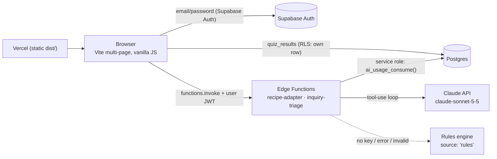

# FuelWell

**Familiar food. Thoughtful care.** FuelWell helps an adult child cook the family's Chinese, Korean and Vietnamese dishes for a parent with chronic kidney disease (stage 3b-4), and keeps the parent's care team in the loop.

It is a student product demo. All health data is sample data, and nothing in it is medical advice.

- **Live demo:** `<VERCEL_URL>`. Use the one-click demo at `<VERCEL_URL>/start.html?demo=1`
- **Demo login:** `heidi_demo@fuelwell.app` / `FuelWell-Demo-2026` (a public, pre-confirmed account holding sample data only)
- **How it was built:** `<VERCEL_URL>/how-it-was-built.html`

## Features by tab

| Tab | What it does |
|---|---|
| **Today** | Overview for Heidi, caring for her mom Fung (78, CKD G3b): today's meals, nutrient status, next visit. |
| **Meals** | A sample week of Cantonese home cooking with potassium, phosphorus and sodium bars (low/mid/high, always text-labelled). **AI recipe adapter:** type a family dish and get a kidney-friendlier version with per-ingredient numbers and swaps. |
| **Care team** | Visits and messages. **AI question triage:** a caregiver's question is classified, checked for red flags, answered with a reviewable draft and matched with open dietitian slots. Shows "How the agent handled this". |
| **Health & labs** | Sample lab trends (eGFR, potassium, phosphorus) explained in plain language. |

The public site (Home, How it works, For families, Meal planning, Questions) and the account flow (sign in, sign up with a short matching quiz, demo login) are separate pages.

## Architecture



```
frontend/                 HTML entry points, styles (styles.css = design system), page scripts
frontend/auth/            Supabase browser client, sign-in/sign-up, demo account
frontend/scripts/ai-client.js   typed client for both AI functions (the UI contract)
frontend/data/            sample meal and patient data
supabase/functions/       Edge Functions (Deno)
  _shared/renal-data.mjs  nutrient table, thresholds, swaps, dish library (single source of truth)
  _shared/*.ts            auth + quota guard, HTTP/validation, tool loop, FAQ/red flags/slots
  recipe-adapter/         Agent 1
  inquiry-triage/         Agent 2
backend/migrations/       001_quiz_results.sql, 002_ai_usage.sql
.claude/skills/renal-recipe-check/   custom Claude Code skill + Node checker
```

## The AI agents

Both agents are real tool-use loops on the Claude Messages API (official `@anthropic-ai/sdk`), running in Supabase Edge Functions. The model plans and writes; **code** looks things up, does all arithmetic, enforces safety and validates the final JSON.

### 1. `recipe-adapter`: cultural recipe adapter
`{ dish, cuisine? }` → adapted recipe with per-ingredient K/P/Na, before/after totals, low/mid/high levels, swaps and tips.

| Tool | Runs as |
|---|---|
| `lookup_nutrients(ingredient)` | Fuzzy match over 88 ingredients (USDA FoodData Central SR Legacy/FNDDS, FDC IDs in source) or "unknown" |
| `compute_totals(ingredients[])` | Code multiplies and sums; the model never does maths |
| `submit_adaptation(...)` | Final structured output, validated: every ingredient must be in the table, totals are recomputed, sodium may not rise, no dosing language |

Levels use per-meal **demo heuristics** derived from NKF/KDOQI daily ranges: K < 400 low, ≤ 700 mid; P < 200 low, ≤ 300 mid; Na < 400 low, ≤ 700 mid (mg).

### 2. `inquiry-triage`: caregiver question triage + booking
`{ message, patient_name? }` → category, urgency, red flag, escalation, draft reply, suggested slots and a step log. It mirrors leasing-inquiry triage plus tour booking.

| Tool | Runs as |
|---|---|
| `check_red_flags(text)` | Deterministic regex rules (chest pain, trouble breathing, confusion, no urine, severe swelling, muscle weakness, irregular heartbeat, fainting, seizure) |
| `search_care_faq(query)` | BM25 over 15 FAQ entries (diet, scheduling, insurance, labs, caregiver role, emergencies) |
| `get_open_slots(preference?)` | Next weekday dietitian slots, 9am-4pm Pacific, computed from today |
| `submit_triage(...)` | Final output, validated: slots must be ones actually offered, no medicine/dose instructions |

**Red flags are enforced by code:** the function re-runs the rules on the raw message and forces `urgency: 'urgent'`, `red_flag: true` and a call-911-or-care-team escalation, whatever the model returned.

### Production hardening
- `verify_jwt = true`, plus a server-side `auth.getUser` that rejects the anon key and anonymous users.
- Input validation: JSON object, 8 KB body, 600-character text, enums, control characters stripped. User text is wrapped as data.
- Per-user daily cap in `ai_usage` (RLS on, **no** client policies, service-role only) via an atomic `INSERT … ON CONFLICT DO UPDATE … WHERE calls < limit`: 40/day, 300/day for the demo account.
- `max_tokens` capped, wall-clock deadline per run, per-request timeouts, turn cap, one SDK retry, strict tool schemas, `fallbacks: "default"` for refusals.
- **Reliability fallback:** no API key, an API error, a timeout, a refusal or output that is still invalid after one repair round all return a deterministic rules-based answer with `source: 'rules'`. The demo never shows a blank error.

## AI-assisted development workflow

Built with Claude Code as an orchestrated multi-agent workflow:

1. **Research:** three parallel subagents: a competitor visual/UX audit (DaVita, Fresenius, Nourish, Fay, Season, Foodsmart, Kidney Ally, NKF); accessibility, caregiver and auth research; and a codebase audit plus hiring-fit review.
2. **Contracts:** the orchestrator wrote the design-system contract (`styles.css`) and the typed AI client contract (`ai-client.js`).
3. **Build:** three parallel subagents with strict file ownership: sign-in and public site; the tabbed dashboard; AI functions, skill and docs.
4. **Integration and review:** merge, build, review against the contracts, migrate, deploy.

Tooling: the **Supabase MCP** (project inspection, migrations, Edge Function deploys, logs and advisors), **GitHub**, and the `claude-api`, `supabase` and `artifact-design` skills.

**Custom skill: [`renal-recipe-check`](.claude/skills/renal-recipe-check/SKILL.md).** It triggers when meal or recipe data is added or edited. It imports the same `renal-data.mjs` as the Edge Function and flags unrealistic values, badge/threshold mismatches, unknown ingredients and missing disclaimers, then suggests culturally faithful swaps:

```bash
node .claude/skills/renal-recipe-check/scripts/check-meals.mjs              # frontend/data/*.js
node .claude/skills/renal-recipe-check/scripts/check-meals.mjs --dish pho
node .claude/skills/renal-recipe-check/scripts/check-meals.mjs --self-test
```

## Run locally

```bash
npm install
cp .env.example .env     # VITE_SUPABASE_URL + VITE_SUPABASE_ANON_KEY (publishable key only)
npm run dev
```

Apply `backend/migrations/001_quiz_results.sql` and `002_ai_usage.sql` to your Supabase project. The AI tabs call the deployed Edge Functions; without them the client shows a friendly "not set up" message. `npm run build` writes `dist/`.

## Deploy

**Vercel:** Vite preset (`npm run build`, output `dist`). Set `VITE_SUPABASE_URL` and `VITE_SUPABASE_ANON_KEY` for Production and Preview. Never put a secret or service-role key in a `VITE_` variable. Add the Vercel URL to Supabase Auth redirect URLs (see `backend/auth-setup.md`).

**Supabase:**

```bash
supabase link --project-ref <PROJECT_REF>
# 1. Database: run backend/migrations/002_ai_usage.sql (SQL editor, psql, or the Supabase MCP)
# 2. Secret (server-side only):
supabase secrets set ANTHROPIC_API_KEY=sk-ant-...
# 3. Functions (verify_jwt = true is set in supabase/config.toml):
supabase functions deploy recipe-adapter
supabase functions deploy inquiry-triage
```

`SUPABASE_URL` and `SUPABASE_SERVICE_ROLE_KEY` are injected into Edge Functions automatically. Without `ANTHROPIC_API_KEY` the functions still work in rules mode.

## Safety and disclaimers

- FuelWell is a student project, not a medical device, and does not provide medical advice, diagnosis or dosing. Personal targets come from the person's kidney care team.
- Nutrient values are approximate, from USDA FoodData Central with marked approximations. Thresholds are labelled demo heuristics.
- All patients, labs, visits and messages are sample data. Do not enter real health information.
- The triage agent drafts replies for a care team to review; urgent symptoms are escalated by deterministic code, not by the model.
